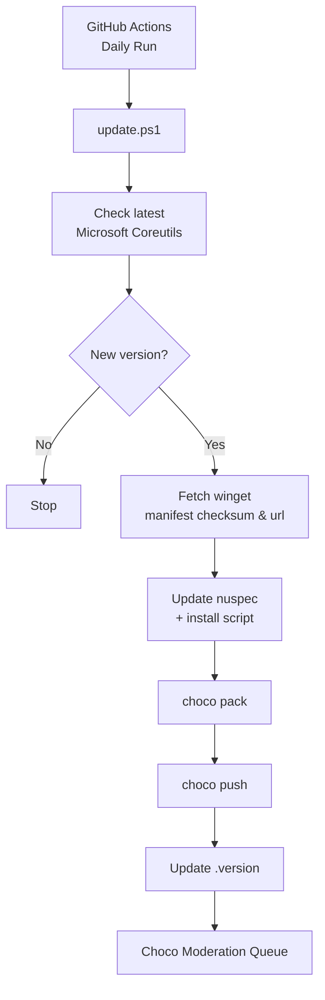

# MS CoreUtils Choco Package

<!-- Commented out until approved

--->

This is a chocolatey package for the public community repo for [MS CoreUtils](https://github.com/microsoft/coreutils)

## Overview

Unix CoreUtils from [CoreUtils](https://github.com/uutils/coreutils) is a modern implementation of 
the GNU Utils in Rust rather than the original C based [CoreUtils](https://www.gnu.org/software/coreutils/). 
MS has repackaged these for compatability in MS Windows environments where possible/relevant.  

It also includes [findutils](https://github.com/uutils/findutils) and [grep](https://github.com/uutils/grep)

Also see: https://learn.microsoft.com/en-us/windows/core-utils/overview

## Automation

This nupkg creation runs as a github action, it pulls metadata from Microsoft's winget manifest daily and pushes
any new release to chocolatey via API key.

